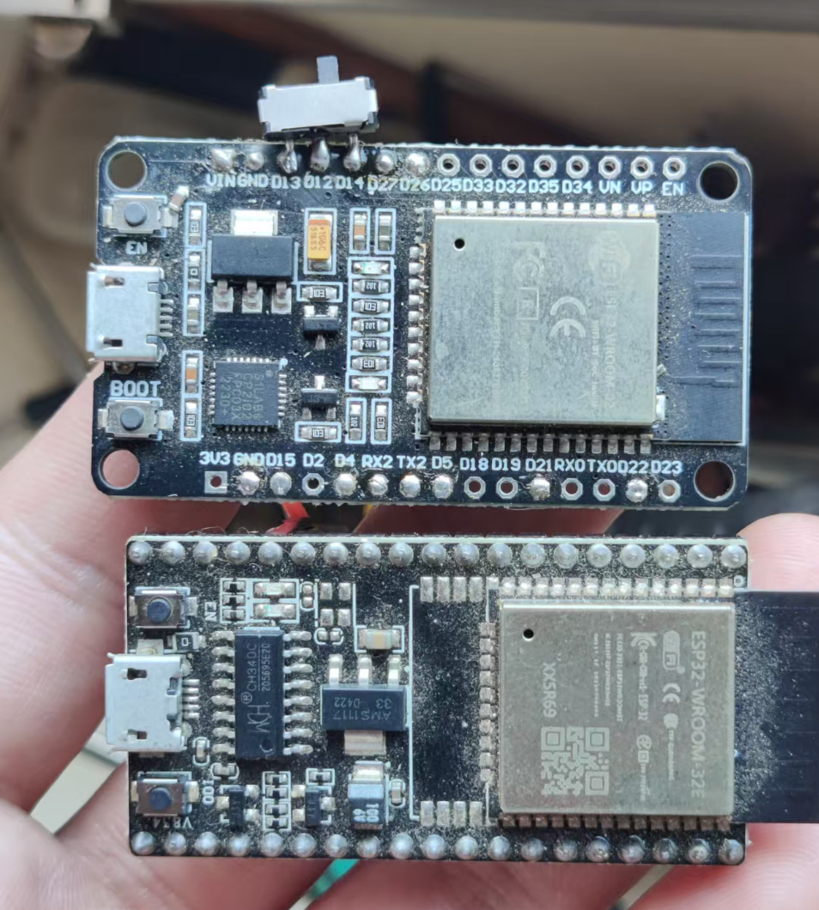
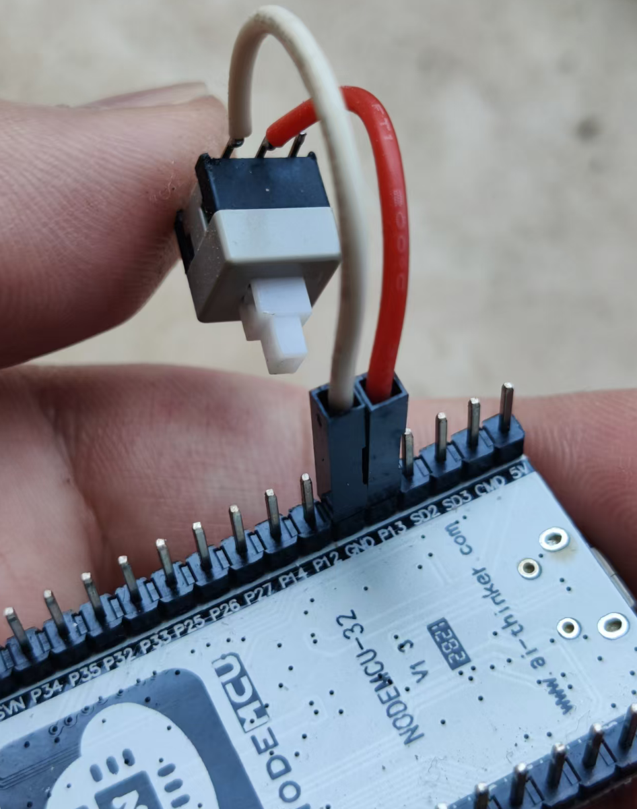
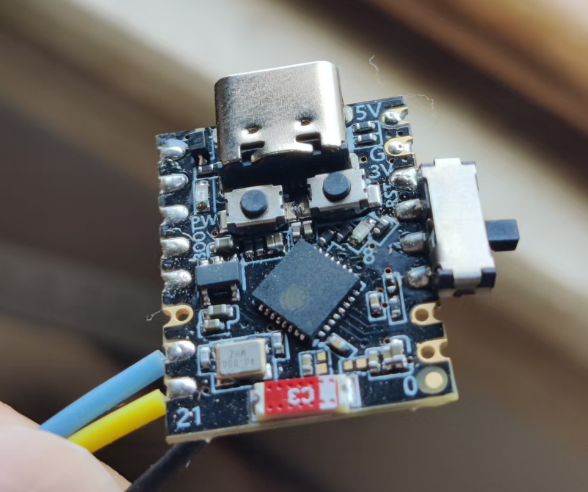
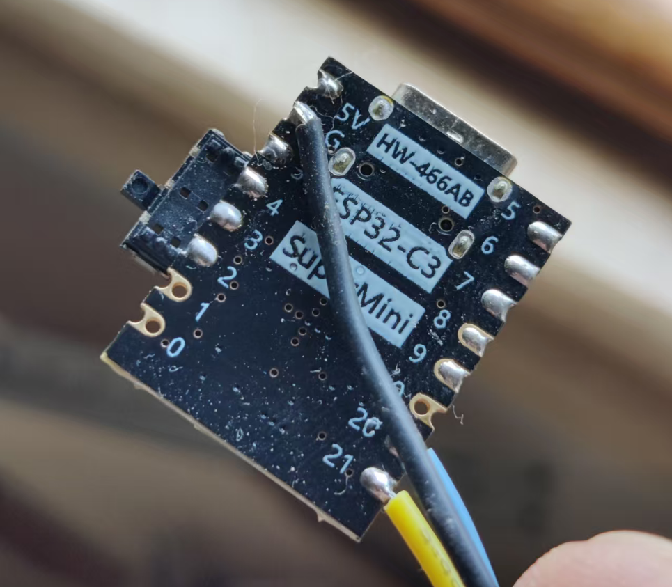
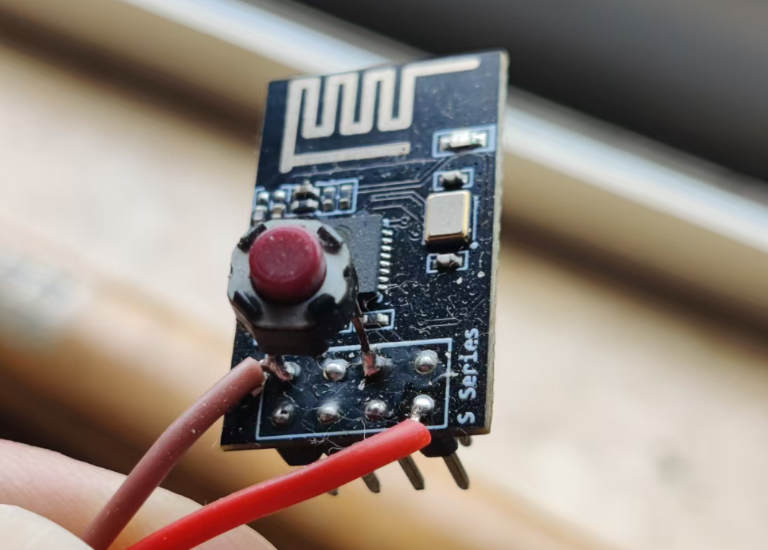
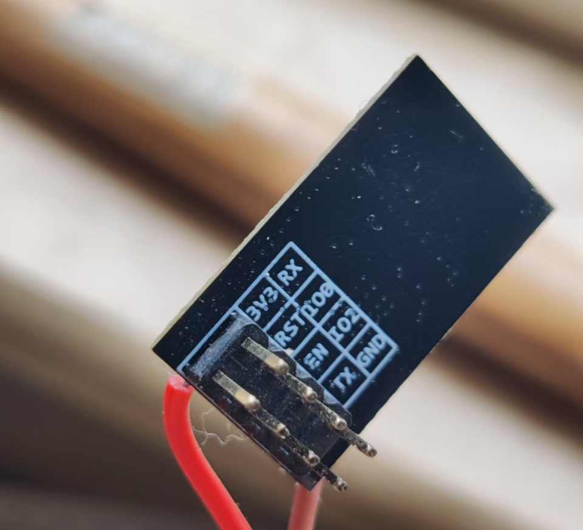

AkiLink-ESP 中英双语描述

## 简介 Brief

AkiLink-ESP | ESP系列多模透传模块。支持 **`ESP32、ESP32-C3、ESP8266/8285`** 三种芯片，集成 **`TCP、UDP、SPP、BLE、ESP-NOW`** 五种透传模式，近距离高速传输，适用于调参和传数据.

AkiLink-ESP | Multi-mode Transparent Transmission Module for ESP Chips. Supports **`ESP32, ESP32-C3, ESP8266/8285`**, integrated with 5 transmission modes (**`TCP, UDP, SPP, BLE, ESP-NOW`**). Close quarter high speed transmission, meant for tune parameters and sending data.

## 使用说明
每个芯片固件在单独文件夹下，均为Arduino框架。
*`Test_Robust`为ESP-IDF框架，修改了大量底层配置，来适应高干扰环境，但貌似没效果。*
你可以用vs code打开，使用platform io自行编译。记得编译并烧录data中的html以进行调参。

### 引脚设置请看src中的 data_config.h
#### ESP32默认引脚：
##### 电路板图

#####
io 13 —— 默认上拉，开关按钮接GND，开机时检测，拉低进入网页调参模式，运行中改变状态会自动重启
*为了方便在开发板上焊接二段式开关：因为io 12开机时必须拉低。故对于32D，开关3引脚可接io 13,12,14；对于32E，可接io 13,GND,12*

- io 3 ——  UART-0 rx，烧录和debug
- io 1 ——  UART-0 tx，烧录和debug

- io 16 ——  UART-2 rx，数据口
- io 17 ——  UART-2 tx，数据口

- io 2 ——  板载指示灯，连接状态
- io 33 ——  额外指示灯，TCP 模式下是否连接客户端

---
#### ESP32 C3默认引脚：
##### 电路板图

#####

- io 3 ——  默认上拉，开关按钮接GND，开机时检测，拉低进入网页调参模式，运行中改变状态会自动重启
*为了方便在开发板上焊接二段式开关：io4被手动下拉，开关3引脚可直接焊在 io 2, 3, 4 焊盘上*

开启了USB-CDC，UART0 被绑定到USB口
- io 20 ——  UART-1 rx，数据口
- io 21 ——  UART-1 tx，数据口

- io 8 —— 板载指示灯，连接状态。注意C3上是低电平亮
- io 10 ——  额外指示灯，TCP 模式下是否连接客户端

---
#### ESP 8266/8285
##### 电路板图

#####

- io 0 —— 默认上拉，点动按钮接GND，
因为 io 0 开机时必须内部上拉，故用点动按钮，开机后按住0.5秒 进入/退出 调参模式

- RX ——  UART-0 rx，烧录口和数据口
- TX ——  UART-0 tx，烧录口和数据口

8266的UART-1只有tx，pin为2，还只能和LED复用
- io2 —— 板载指示灯，连接状态

### WEB调参
按下开关后启动，或启动后按下开关（会自动重启），进入调参模式
WIFI热点连接后，浏览器打开 10.0.0.1，调节参数，剩余说明全在html里这儿就不多说啦🤪
设置为STA模式后，由于有家庭无线路由器中介，信号好的多。你得重启ESP，再次进入网页调参，记下右上角的动态分配的STA IP，以与上位机或其他ESP进行连接。

